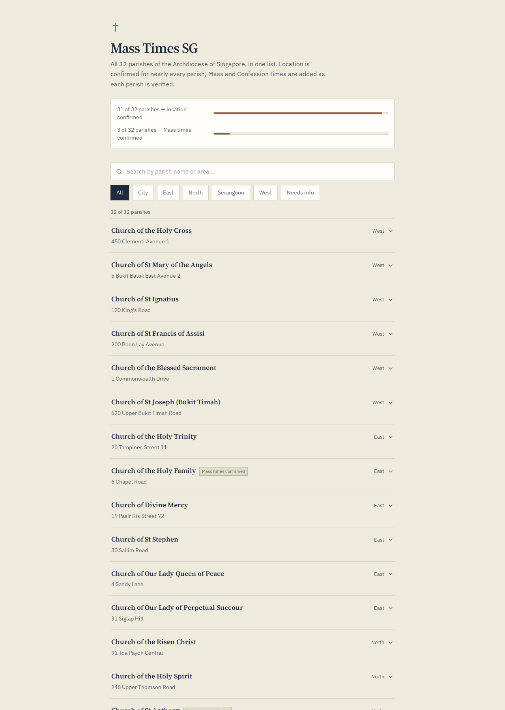

# Mass Times SG

A clean, fast, mobile-first directory of every parish in the Archdiocese of Singapore — with verified addresses, Mass times, and Confession times.

**Live demo:** https://sgmasstimings.lovable.app



## Why I built this

I wanted a portfolio piece that shows I can take a real-world information problem, design around it, and ship a polished frontend. Catholic Mass times in Singapore are scattered across 32 different parish websites, PDFs, and bulletin boards. This app gathers them into one searchable, filterable list and makes the data quality transparent: every parish shows whether its schedule has been verified or is still missing.

## What it demonstrates

- **React 19 + TanStack Start** — full-stack React with file-based routing, SSR/SSG-ready.
- **TypeScript** — strongly typed data models and component props.
- **Tailwind CSS v4** — custom design tokens, dark-aware semantic colors, no hardcoded hex values in components.
- **Accessibility** — semantic HTML, ARIA labels, keyboard-friendly filters, live region for search results.
- **Performance** — no runtime data fetching on first paint; all parish data is statically typed and tree-shaken into the bundle.
- **SEO** — unique meta titles/descriptions, Open Graph tags, canonical links, JSON-LD structured data.
- **Data integrity** — a clear "verified vs. missing" signal so the UI never over-promises completeness.

## Features

- Search by parish name, address, or area
- Filter by region (North, South, East, West, Central, City, Needs info)
- Expand any parish to see Mass and Confession schedules
- Stats band showing verification progress
- Contact link for corrections/updates

## Tech stack

- **Framework:** TanStack Start (React 19)
- **Language:** TypeScript
- **Styling:** Tailwind CSS v4
- **Icons:** Lucide React
- **Build:** Vite 8

## Running locally

```bash
# Clone the repo
git clone <repo-url>
cd mass-times-sg

# Install dependencies
bun install
# or: npm install

# Start the dev server
bun run dev
# or: npm run dev
```

The app will be available at `http://localhost:8080`.

## Project structure

```
src/
  components/       # Reusable UI components (ChurchRow, StatsBand)
  data/           # Static parish dataset and types
  routes/         # TanStack Start file-based routes
  styles.css      # Global tokens, theme, Tailwind imports
public/           # Static assets
```

## Data sourcing

Addresses come from the official Archdiocese of Singapore parish list. Mass and Confession times are added only after being checked against each parish's own published schedule — nothing is estimated to make the dataset look more complete than it is. Parishes marked "Needs info" are explicitly waiting for verification.

## License

MIT — feel free to use this as a reference or starting point.

## Contact

Spotted an error or want to suggest an improvement? Open an issue or email the address in the app footer.
